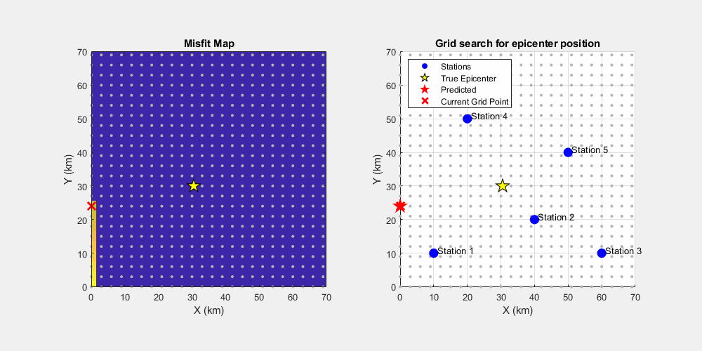

# Grid-Search-Epicenter

Grid search is an inversion method that evaluates model parameters in a given model space, based on the objective function values ​​in a systematic way using grids. Each grid represents one model sample. Grid search is the easiest way to obtain non-linear inversion solutions, because it does NOT require the calculation of gradients or derivatives of the objective function. HOWEVER, it is very inefficient considering the large number of forward modeling calculations that must be performed.
This method is rarely applied to real geophysical problems.

This video shows the application of grid search to determine the location of an earthquake epicenter (synthetic).

